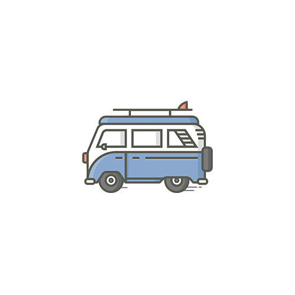

# My Hobby - A Git assignment

---

### Course: Working Methodology For Developers

---

**This project is about creating a webpage dedicated to one of my hobbies. The purpose of this task is to demonstrate proficiency in using Git and working methodically with its features.**

---

### Hobby Description:

**Travel may not be classified as a hobby in many people's eyes, but I would say that for me, traveling is like playing football for someone else; it's my greatest interest in life, I often refer to it as a lifestyle and not just a hobby.**

Traveling isn't just a pastime for me; it's woven into the fabric of 
my lifestyle. It's a pursuit that fuels my curiosity, broadens my perspective, and fills my life with unforgettable experiences.

One of the most compelling aspects of travel is its ability to 
break down barriers and connect me with people from diverse cultures 
and backgrounds.

traveling challenges me to step out of my comfort zone and embrace 
the unknown. It's in those moments of uncertainty navigating a foreign city without a map or trying a dish with unfamiliar ingredients that I discover my resilience and adaptability.

Beyond the thrill of exploration, travel also offers a profound sense 
of freedom and adventure.

**In essence, travel isn't just a hobby for me; it's a way of life.
It's a journey of self-discovery, adventure, and connection that shapes who I am and how I see the world**

---

### Project Structure

**The project is structured as follows:**

- index.html: Main html file for the project. 
- style.css: Main file for styling. 
- Public/images: Images for the project. 
- Public/icons: Icons for SVG icons.
- ImageData.js: json-file with image data. 
- textContent.js: Text content to explain my hobby.
- main.js: Imports, InnerHTML and functions for modal.
- modal.css: Styling for modal.
- modal.js: Function for modal. 

---

### Git Usage

##### For Grade G:

**To achieve Grade G, the following Git commands have been utilized:**

- `git add`: Used to stage changes for commit.
- `git commit`: Used to commit changes to the repository.
- `git branch`: Used to create new branches.
- `git checkout`: Used to change branch.
- `git merge`: Used to merge branches to dev-branch and then to Main branch. 
- `git status`: Used to see status for your work.
- `git log`: Used to check your history for commits.
- `git push & git pull`: Used to send your commits to a specifik branch.

---

### Project Setup

**To setup the project locally, follow these steps:**

1. Clone the repository from GitHub:

`git clone https://github.com/JohannaPri/My-Hobby-Git`

2. Install dependencies:

`npm install`

3. Start the development server:

`npm run dev`

---

### Contributor

Johanna Prinz 
- GitHub: [@JohannaPri](https://github.com/JohannaPri)

---

## Screenshots:

##### The Whole Page

##### Whole Page With image zoomed in (Modal)

---

### Image Credits

- **Pixabay:** https://pixabay.com

- **Pexels:** https://www.pexels.com/sv-se/

- **Unsplash:** https://unsplash.com

---

